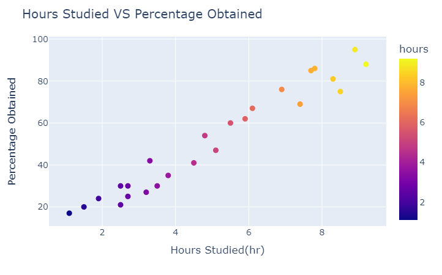
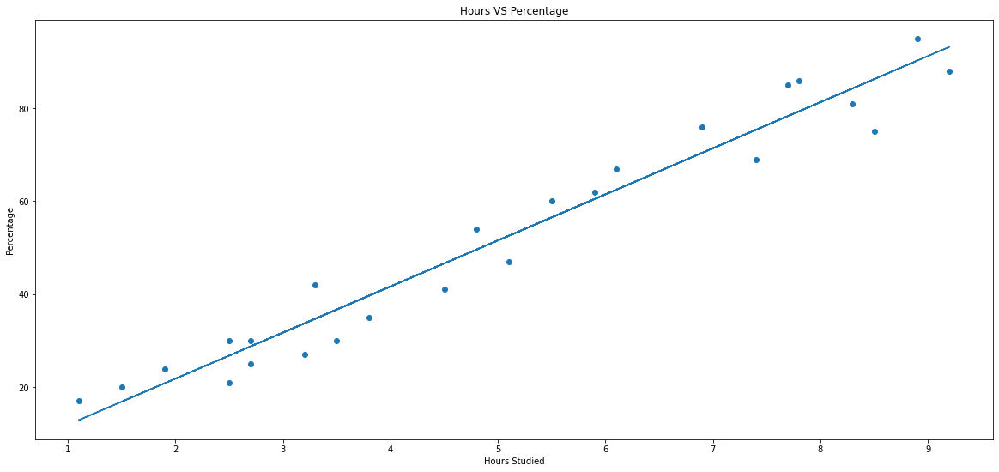

<h1 align="center">Student Percentage Prediction</h1>

---
## Description:


<h3 align = 'center'><i>"If you want excellent scores, you need to study more."</i></h3>

I always took this saying with a grain of salt. 

This project, I aim to end my skepticism regarding this proverb. Using `Unsupervised ML algorithim`, I am going to calculate the `correlation` by a `linear regression test` between hours studied and precentage scored by a student.
>`Correlation` is a statistical term describing the degree to which two variables move in coordination with one another. If the two variables move in the same direction, then those variables are said to have a positive `correlation`. If they move in opposite directions, then they have a negative `correlation`.
---
## Project Goals:
- Predict the percentage of a student based on the no. of study hours
- What will be predicted score if a student studies for 9.25 hrs/day?
---
## Prerequisites:
In order to perform the intended test, I'll using `python3` as the main programming language and `Jupyter Notebook` as the computing platform.
I'll also require the below mentioned libraries to perform complete the task.
   1. Pandas
   2. Numpy
   3. Plotly
   4. Matplotlib
   5. Scikit-learn

If you do not have these libraries installed in your machine, Kindly run one of the below mentioned command.
> I recommend creating a `virtual environment` because it helps to keep dependencies required by different projects separate by creating isolated python `virtual environments` for them.

```bash
# if you use pip Packager
pip install pandas numpy plotly matplotlib notebook scikit-learn
```
```bash
# If you are using conda Packager
conda install pandas numpy plotly matplotlib notebook scikit-learn
```
---

## Dataset:
> Data Available at: [student_scores](https://raw.githubusercontent.com/AdiPersonalWorks/Random/master/student_scores%20-%20student_scores.csv)

### Key details of the dataset:
   1. The dataset contains two columns:
      - Hours `Number of hours spent while studying`
      - Scores `Percentage achieved by the student`
   2. The dataset has a `long-format` i.e number of rows exceed the number of columns.

   ---

   ## Procedure and Result:

   - To initialize the project, I decided to manually plot a `hours vs scores` plot to manually identify any relationships between the two variables.



- The above scatter plot makes the fact very clear that both the variables i.e `Hours Studied` and `Percentage Obtained` exhibits a very high correaltion of positive nature with a correlation coef of `0.9761906560220885`. 
```python
# Calculating the correlation coefficient
corr_coef = data_df.hours.corr(data_df.scores)
>>> 0.9761906560220885 
```
- The next step involved the splitting of dataset into training and testing sets which is an important part of evaluating data mining models. 
Firstly, I split the dataset into attributs(inputs) and labels(outputs) which is followed by uusing the `Scikit-Learn` built-in `train_test_split()` method.
- Now we can sucessfully train our algorithim using the `Scikit-Learn` built-in `LinearRegression` method and finally predict `score of a studying for 9.25 hrs/day`.



-  The score predicted by our algorithim is `93.69173249` and the Mean Absolute Error is `4.183859899002982`.

